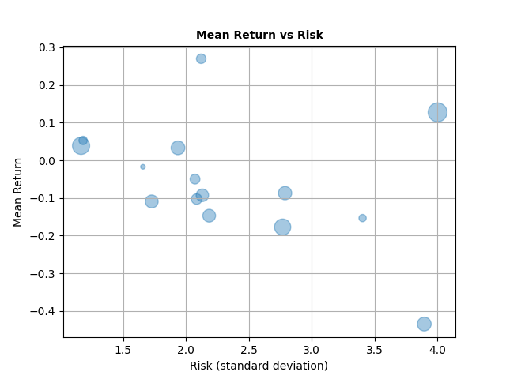
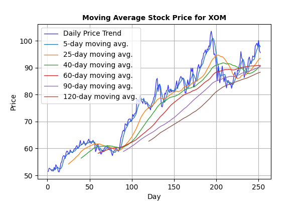

Describe:
|       |      JPM |      XOM |      CRM |     AMZN |     TSLA |      TWTR |     AAPL |      ORCL |     GOOG |       ZM |       MCD |      NKE |     SBUX |         T |        KO |
|:------|---------:|---------:|---------:|---------:|---------:|----------:|---------:|----------:|---------:|---------:|----------:|---------:|---------:|----------:|----------:|
| count | 252      | 252      | 252      | 252      | 252      | 252       | 252      | 252       | 252      | 252      | 252       | 252      | 252      | 252       | 252       |
| mean  | 139.346  |  75.7105 | 220.204  | 148.381  | 296.774  |  44.8698  | 157.75   |  81.315   | 130.731  | 160.336  | 246.765   | 136.494  |  93.2847 |  18.5726  |  58.9734  |
| std   |  18.9009 |  14.255  |  45.9211 |  23.2182 |  47.5463 |   9.29933 |  12.5479 |   8.71939 |  13.4385 |  68.2344 |   9.84017 |  22.2698 |  14.7628 |   1.21398 |   4.08262 |
| min   | 108      |  51.3189 | 155.6    | 102.31   | 209.387  |  32.42    | 129.88   |  63.7648  | 105.44   |  80.4    | 219.575   | 100.89   |  69.1759 |  15.8602  |  50.9288  |
| 25%   | 120.682  |  61.092  | 181.305  | 128.24   | 255.262  |  38.09    | 147.797  |  74.1712  | 116.944  | 107.822  | 239.383   | 114.107  |  79.5386 |  17.6709  |  54.8016  |
| 50%   | 139.217  |  78.5022 | 211.015  | 153.893  | 292.128  |  41.84    | 158.705  |  79.9305  | 134.414  | 122.71   | 246.645   | 135.652  |  89.98   |  18.39    |  59.6918  |
| 75%   | 156.081  |  86.7328 | 259.388  | 168.901  | 336.473  |  49.1175  | 168.63   |  88.3113  | 142.636  | 201.465  | 253.267   | 157.438  | 109.437  |  19.2663  |  62.4585  |
| max   | 168.014  | 103.584  | 309.96   | 184.803  | 409.97   |  67.22    | 181.26   | 102.406   | 150.709  | 301.5    | 265.367   | 175.846  | 116.736  |  21.0398  |  65.2593  |

